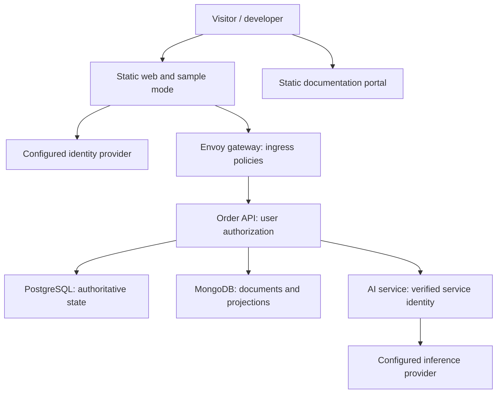

# RelayCart — System architecture and engineering decisions

Design revision: 4
Checkpoint: Step 03B, section 3
Date: 7 October 2026
Status: proposed design for review; no application implementation or cloud deployment is claimed.

This is the initial system architecture, owned by relaycart-docs. Component-specific architecture and runbooks stay in their owning repositories; later versioned documentation aggregation publishes them together. The harness scope/architecture/configuration are recorded in portable-ai-harness at commits 96cc799, 40476cf and 99d47a1 respectively.

## Product and demonstration contract

RelayCart demonstrates one synthetic fulfilment incident: create an order, trigger a supplier failure, recover without duplicate effects, inspect the event timeline and request an evidence-grounded AI explanation. No real payment, customer data, logistics account or production integration is involved.

Sample mode is a complete static experience using labelled fixtures and saved explanations; it makes no mandatory live API, identity, inference or telemetry call. Live mode uses real authenticated services and persisted synthetic data. Visitors can explicitly choose a capped isolated sandbox; signed-in workspace scenarios additionally demonstrate identity and authorization. A visible state indicator distinguishes sample, live, waking service, unavailable and insufficient evidence.

## Service and repository ownership

| Repository | Owns | Boundary |
|---|---|---|
| `relaycart-web` | React/TypeScript UI, sample fixtures, live client, accessibility and browser tests | Holds no service/database secrets; backend enforces authorization |
| `relaycart-api` | FastAPI order/inventory domain, identity verification, sandbox capabilities, callbacks, retry jobs, outbox, SQL migrations and Mongo indexes | Sole application owner of SQL/Mongo writes and authorized evidence retrieval |
| `relaycart-ai` | TypeScript/Hono inference gateway, prompt version, fake/local/Workers AI adapters, bounded input and validated output | No database credentials, state-changing business tools or arbitrary evidence retrieval |
| `relaycart-contracts` | Published OpenAPI snapshots, shared event/AI JSON Schemas, examples and generated clients | API code generates OpenAPI; snapshot promotion and consumer compatibility are reviewed, not separately hand-maintained competing endpoint definitions |
| `relaycart-infra` | Provider modules/bootstrap, Compose, Envoy gateway configuration/image, pinned checkout manifest, dashboards and tested deployment/rollback orchestration | Owns resources and release composition, not business logic |
| `relaycart-docs` | System views, decision index, public walkthrough and pinned product-doc aggregation | Owns publication; other repos own their component facts |
| `portable-ai-harness` | Developer context/specification/implementation/check/review tooling | Never an application dependency; used during development and CI with explicit pinned versions |

The API is internally modular: HTTP transport, domain services, persistence, identity and external adapters. Inventory/order atomicity is retained within one relational transaction. AI is independently deployed because its credentials, quotas, failure modes and runtime differ. No service for every entity, service mesh, Kubernetes cluster or broker is required initially.

## Live runtime topology

The identity-provider arrow represents browser sign-in, not authorization granted by the browser. Sandbox capability issuance is API-owned and does not require external sign-in. AI ingress is an authenticated HTTPS service boundary even though the public endpoint is reachable. Static hosting, application APIs, databases and inference are separate failure domains.

## Data ownership and integrity

| PostgreSQL authority | MongoDB documents | Rule |
|---|---|---|
| Workspaces/memberships, products, inventory, orders and business events | Synthetic partner payloads and runbooks | Authorization is API-owned; document reads remain tenant-scoped |
| Idempotency records, callback deduplication and durable due jobs/leases | Read-oriented incident projections | Mongo projection lag cannot alter transactional order truth |
| SQL outbox, projection cursors/status and bounded demo/inference admission records | Upserted projection documents with source event/version identity | Commit domain changes and outbox in one SQL transaction; replay safely |

Use SQL constraints and transactions for stock and duplicate effects. A uniqueness conflict is handled deliberately, not interpreted as a generic internal error. Idempotency keys are scoped to caller/workspace/operation and bound to a normalized request hash: matching retries return the original outcome; changed payloads with a reused key fail clearly.

Validate authenticated callback signatures before processing. Deduplicate by scoped partner event identity, and guard legal order-state transitions/version checks against out-of-order events. There is no claim of exactly-once network delivery. The guarantee is no duplicate business effect in tested scenarios under defined constraints and retries.

The outbox is durable; projection application is at-least-once with idempotent upserts. Use a monotonic aggregate/event sequence or an equivalent tested conditional update so stale replay cannot overwrite newer projection state. Mongo failure leaves orders available with explicit degraded evidence/projection status; inference can decline when necessary evidence is unavailable. Keep payload size, record count and retention bounded.

## Durable recovery under free-host constraints

Persist attempt count, next due time, lease owner/expiry and terminal/quarantine state. Workers claim due jobs atomically with guarded leases and commit outcomes consistently. Model side effects as idempotent commands/events; expired leases allow recovery after a restart. Do not keep a sleeping-service job in memory or sleep inside a long HTTP request.

For the free demo, an explicitly active browser scenario makes bounded authorized POST advance calls that process a limited amount of due work. Similar processing can be invoked in local tests. Work resumes when the service is active; it is not guaranteed to run at its wall-clock due time while the backend sleeps. Stop advance polling when the scenario is inactive or its deadline expires. Never use keep-awake traffic to imply an always-running worker.

The supplier/carrier simulator is an API-owned synthetic adapter with predetermined actions and bounded signed callback scenarios. It does not accept arbitrary outbound URLs or execute user-provided scripts. A production evolution replaces request-driven advancement with a durable queue/worker and real partner adapters, while preserving state/command contracts.

## Identity, security and network boundaries

| Boundary | Required design / verification |
|---|---|
| Browser → API | TLS, validated schema/body limits, authenticated principal or narrowly scoped sandbox capability, endpoint/object authorization and safe errors |
| User identity | Firebase adapter for the selected cloud profile; validated issuer/audience/signature/expiry using supported verification. Roles/membership come from SQL, not browser-selected claims |
| Self-hosted identity | Standards-based OIDC adapter, tested with a documented local provider such as Keycloak; normalized principal with explicit issuer/audience policy |
| Sandbox | API-issued short-lived capability restricted to one synthetic sandbox, permitted operations, expiry and record/admission caps; never accepted as general workspace/admin identity |
| API → AI | Short-lived signed service token, pinned accepted algorithm/issuer/audience/expiry, rotating protected signing material and validated bounded evidence request |
| API → stores | TLS verification on remote connections, least-privilege runtime credentials, separate migration credentials and explicit network allowlists where supported |
| AI → provider | Server-side binding/token, configured destinations, request/output/time limits and no browser credentials |
| CI/deployment | Reviewed trusted workflow, minimum permissions, pinned actions/artifacts, no secrets in fork-PR jobs and separate protected migration/deployment access |

CORS allowlists are browser controls, not authentication or a network firewall. Reject caller-selected tenant access unless membership/capability permits it. Test every tenant-scoped read/write with two isolated principals. Generic health/version routes disclose only necessary information; public documentation does not expose migration/admin/SQL operations.

Public free-tier networking is not private networking. Allowlisted Render outbound ranges for Mongo are shared egress, not exclusive service identity; retain strong credentials and TLS. No blanket internet database allowlist merely to make a demo work. Allow only configured callback/provider destinations; do not turn the API into an arbitrary HTTP proxy. Secrets stay out of logs, static assets, contracts, Git, reports and images.

For on-premises, expose only authenticated application ingress through a configured TLS reverse proxy; databases/collector remain on internal networks. Local development may bind debug/database ports to loopback explicitly. Compose networking alone is not an enterprise security perimeter. Production evolution documents private networking, managed secrets, stronger ingress controls and operational ownership.

## Secrets management

Secrets are stored in the deployment environment that needs them and supplied at runtime through documented configuration. The application does not depend on a provider's secret-management SDK. The free-cloud profile uses existing platform facilities; the self-hosted profile uses restricted mounted files. A dedicated Vault deployment is not required for the MVP. Centralized managed secrets, workload identity and automated rotation are documented production extensions.

| Environment | Storage and delivery | Boundary / implementation requirement |
|---|---|---|
| Developer Mac | Git-ignored local .env/.dev.vars where needed; sensitive key files in an external restricted directory | Prefer OS credential storage for durable personal credentials; directory mode 0700 and files 0600 where supported; Git ignore does not encrypt files |
| GitHub Actions | Repository or deployment-environment secrets; short-lived platform identity where a tested integration supports it | Deployment credentials are available only to trusted deployment jobs; production runtime values normally remain in their host's secret configuration |
| Render API/gateway | Per-service secret environment variables or secret files; environment groups only for deliberately shared values | Runtime injection; no broad group granting every service every credential; prebuilt images receive no production secrets during CI builds |
| Cloudflare AI Worker | Worker secret bindings for confidential values and Workers AI binding for the selected inference provider | Separate environments; no confidential values in Wrangler vars, source or static client bundles |
| Self-hosted / on-premises | Restricted files outside repositories, mounted read-only into the intended containers through Compose secrets or equivalent | Compose file-backed secrets are files, not an encrypted vault; host access, backup protection and container ownership must be configured and tested |

Committed examples contain placeholders and secret names only. Documentation publishes an inventory of names, consumers, purpose, provisioning steps, required/optional status and rotation owner; it never publishes values. Public URLs, JWT verification public keys/JWKS and browser identity configuration are public configuration. Database passwords, private signing keys, gateway service-proof credentials, optional model API keys, deployment/DNS API tokens and authenticated telemetry credentials are secrets. Synthetic development credentials are explicitly labelled and never reused in a deployed environment.

### Least privilege and bootstrap

- The API alone receives runtime SQL/Mongo credentials. Separate migration credentials are available only to trusted migration operations and are not normal application settings.
- The API owns its API-to-AI private signing key; the AI service receives the verification public key or configured JWKS location, never the signing private key. Sandbox signing material is API-owned and purpose-separated.
- The gateway receives only its gateway-to-API proof credential, and the API receives the corresponding verification material. Caller identity remains independently verified. Configure Envoy secret delivery at runtime without embedding the credential in a published image or committed configuration; redact proof headers from access/error logs.
- Provider API keys belong only to the AI service or, for development, the harness's explicitly selected local adapter. The web/docs/contracts layers receive no confidential runtime credentials.
- Use unique development/test/deployed credentials. CI uses disposable test credentials for integration tests and narrowly scoped deployment tokens for supported hosts. No fork-PR job executes untrusted code with deployment secrets; privileged workflow triggers must not bypass that boundary.
- Account owners create initial values through provider dashboards or authenticated CLIs. Account login, MFA, token permissions and initial secret entry are explicit bootstrap steps. Never ask users to paste values into chat, PRs or review artifacts. Runtime startup validates required names and fails safely without printing values.

Provision only references/names through IaC where practical. Terraform's sensitive flag is a display control, not encryption; provider operations can persist confidential values in state. Review state contents and provider behavior, protect state/backups/access, and do not commit state or plan files. Any workflow that deliberately manages secret values through Terraform needs a documented protected state backend and access policy first. Do not duplicate runtime secrets into GitHub merely to make a build work.

### Rotation, recovery and leak response

Record owner, purpose, creation/rotation date and non-secret key identifier. For signing keys, install new verification material first, switch the signer, allow only the documented overlap needed for existing token expiry, then retire the old key. For database, gateway and provider credentials, use provider-supported overlapping credentials or a documented maintenance cutover; update consumers, redeploy/reload as required, verify access, then revoke the old credential. Revocation tests include gateway-bypass protection and service-token rejection. A secret rollback cannot assume a revoked credential still works.

Recover via credential reissuance or a separately protected backup where essential, not from Git history. If exposure is suspected, revoke/rotate first, assess access and affected artifacts, then remove exposed material from logs/history/archives as appropriate. Preserve a sanitized incident record. GitHub masking and scanner success do not prove every transformed secret is redacted.

### Harness and verification boundary

The harness's context collection denies secret-file paths independently of Git ignore, excludes private key material, and avoids dumping the environment into prompts or reports. Provider adapters resolve named credentials only at invocation; values do not enter model context, run reports or generated documentation. Commands requiring a credential receive only the necessary value; arbitrary approved local commands still run with the user's privileges, so this is not an OS sandbox guarantee.

Before launch, demonstrate missing-secret safe failure, denied secret context reads, redacted authentication errors/logs, rotation and revoked-key rejection. Scan source, final images and sanitized retained artifacts for seeded test-secret leakage. Exclude local secret files from both Git and Docker build contexts; never use production secrets as Docker ARG/ENV instructions or bake generated secret configuration into an image. For provider-side builds, explicitly audit secret exposure and build-context behavior; Render can expose configured values to its Docker build process, so prefer the prebuilt image path. Test self-hosted file readability by intended container users and inability of unrelated services to obtain the files.

## Portable API gateway and policy ownership

Proposed gateway: Envoy proxy as a separate pinned OCI container, configured in relaycart-infra. This is plain Envoy, not the Kubernetes-dependent Envoy Gateway deployment. No eighth repository is needed for configuration and image packaging. Validate its startup, dynamic listen port, memory and upstream TLS behavior on Render before claiming cloud compatibility; resource sizing can change the cost estimate.

| Policy | Gateway responsibility | API responsibility / acceptance |
|---|---|---|
| Identity | Validate supported JWT issuer/audience/signature/expiry on protected routes; explicit exceptions for health, sign-in-independent sandbox issuance and signed callbacks | Verify identity/capability independently and authorize workspace/object/operation; distinguish token types |
| CORS | Explicit browser-origin, method and header policy; tested OPTIONS preflight and credential behavior | Never treat CORS as caller authentication; avoid contradictory duplicate policies |
| Rate limits | Bounded per-instance ingress token buckets with explicit 429 behavior | Shared SQL admission/quota enforcement for sandbox/inference; per-instance limits are not fleet-wide quotas |
| Allowlisting | Host/route/method allowlists; optional source CIDR restrictions for administrative interfaces | Tenant membership and signed callback verification; outbound destination allowlists |
| Abuse controls | Body/header limits, timeouts, restricted routes and safe error responses | Schema validation, idempotency, transaction limits and bounded work |
| Correlation | Propagate validated trace context and request identifiers; redact credentials | Persist workflow IDs through retries and publish version/health safely |

Public visitors cannot be restricted to fixed IP addresses. Source IP policies require a tested trusted-proxy configuration; never trust a caller-supplied forwarded-IP header. Keep the Envoy admin interface private. Application admin/migration operations are not publicly exposed merely because a CIDR policy exists.

Direct upstream access must not bypass gateway policies. Prefer private API ingress where supported. In the free public-ingress profile, require separately verified gateway-to-API service proof on application routes, alongside user identity; overwrite caller-supplied proof headers at the gateway. A narrow health route may remain public. Test direct-origin rejection and key rotation. Document that this protects application access but cannot prevent traffic from reaching the public origin's network edge.

The same gateway/API images and policy configuration work in the free and paid Render profiles and the self-hosted profile. Local integration tests cover denied origins, forged/expired identity, forbidden tenant access, rate limits, disallowed routes and gateway bypass. Private networking, edge DDoS controls and managed WAF capabilities remain deployment-specific additions.

## Bounded, grounded application AI

This is retrieval-augmented generation (RAG): retrieve authorized evidence, augment the prompt, generate an explanation with references. Initial retrieval uses structured order/event queries and approved runbook selection; embeddings and a vector database are not required for this bounded corpus. Retrieval interfaces permit later keyword/semantic ranking without changing the explanation contract. Add semantic retrieval only with a measured benefit and an evaluation set.

The API selects evidence from the authorized order/workspace and approved runbooks, assigns identifiers and sends a limited evidence packet. The AI service validates service identity and schema, invokes its provider, and returns summary, evidence references, diagnostic suggestions and an insufficient-evidence status. The API revalidates references against its supplied evidence. Safe rendering prevents model text from becoming executable UI content.

No model-selected SQL, arbitrary URLs, order mutations or tool execution. Prompt-injection strings in runbooks/payloads are untrusted data. Provider-independent fake cases run in normal CI; actual model evaluations use a separately selected small call budget and record the rubric/results. Valid references alone do not prove a claim is supported; human-reviewed grounding cases are required.

Use an API-controlled shared SQL admission budget for sandbox/global request counts and concurrent inference leases, rather than a per-process counter advertised as global enforcement. Provider token/neuron consumption is separately observed and capped by provider limits; a call-count budget is not an exact token-cost ledger. Bound input/output, use conservative demo allowances and stop on quota signals. Cache only within the authorized scope using evidence/prompt/model identity, with bounded retention.

## Deployment profiles and limitations

| Layer | Selected free-cloud profile | Self-hosted profile |
|---|---|---|
| Web / docs | Separate Cloudflare Pages projects at stable HTTPS provider URLs | Same static artifacts served by configured web containers/ingress |
| Gateway | Separate Envoy OCI image on Render Free, subject to compatibility acceptance | Same gateway image with configured TLS ingress |
| API | Non-root OCI image on Render Free | Same API image with environment configuration |
| AI | Hono Worker entry point with Workers AI binding | Shared HTTP application with Node entry point; fake default, optional local Ollama endpoint |
| SQL / documents | Neon Free PostgreSQL / Atlas Free MongoDB | Compatible versioned PostgreSQL/MongoDB containers and persistent volumes |
| User identity | Firebase Authentication Spark, selected free sign-in method | Tested OIDC provider; optional anonymous sandbox remains separate |
| Telemetry | Optional verified free exporter destination/provider views | Optional Collector/Grafana/Loki profile; traces/metrics added within machine capacity |

A Worker deployment is not an OCI image. Runtime/provider adapters are tested separately so Node success is not claimed as Worker compatibility. Terraform is provider-specific: supported resource modules plus documented account/token/consent bootstrap. Application URLs, credentials, identity/inference adapters and telemetry destinations are configuration; new cloud infrastructure modules still need engineering/testing.

The gateway and API share Render's 750 free instance-hours per workspace per calendar month. Two continuously running services do not fit that allowance. Both can sleep, and sequential cold starts may delay live mode. Scheduled probes consume active time and must not become keep-awake traffic.

Provider constraints checked on 7 October 2026: Render Free sleeps after idle periods, has ephemeral storage, a shared monthly instance-hour allowance and no scaling beyond one instance. Bandwidth/build usage can create charges if payment is enabled; prefer no payment method or documented enforceable spend controls and verify dashboard settings. Free inference and database tiers have quotas and eligibility limits. Atlas Free lacks managed backups, so test synthetic-data logical backup/restore rather than claim enterprise disaster recovery.

Use only synthetic data; define cleanup and restore procedures. No free end-to-end uptime SLA, private-network guarantee or production durability guarantee. Static sample/docs require no backend and remain usable during live-provider failure, subject to their own hosting availability. The production-evolution page specifies which paid capabilities would address each gap and why.

## Domain, paid profile and portability evidence

A personal domain is optional and does not change application architecture. Proposed URLs, subject to availability: www.adrianenns.com for the portfolio, relaycart.adrianenns.com for the demo, docs.adrianenns.com for documentation and api.adrianenns.com for gateway ingress. One registered domain covers these subdomains. Provider HTTPS URLs remain usable as fallbacks.

Keep domain ownership, DNS and hosting separable. Repoint DNS and provision destination TLS before cutover; update identity redirect URLs, audience settings and CORS through configuration. Check www/apex behavior, certificate renewal, DNS TTL and rollback. Cloudflare Registrar currently lists standard .com registration/renewal at USD 10.46/year, but requires Cloudflare nameservers; moving DNS providers requires a registrar transfer. This is a price benchmark, not a registrar selection or availability confirmation for adrianenns.com. Prefer a registrar permitting nameserver changes if independent DNS portability is a priority. Wix permits external hosting through A/CNAME records but does not permit changing nameservers of Wix-registered domains. Cloudflare Pages supports externally managed DNS for www and other subdomains; its apex custom-domain setup requires Cloudflare nameservers. Therefore Wix is usable for the proposed subdomain URLs but is not the preferred registrar for independent DNS portability. Verify domain-only checkout, currency, tax and regular renewal price; an advertised $7 price is not assumed to be the recurring renewal rate.

Planning estimates checked 7 October 2026, USD before taxes, overages and currency conversion:

| Profile | Estimated recurring hosting | Assumptions / limitations |
|---|---|---|
| Free MVP | $0/month | Free static hosting, sleeping gateway/API, free database/identity/inference allowances; no end-to-end SLA |
| Small always-on gateway/API | Approximately $14/month | Two $7 Starter instances on a $0 Hobby workspace, if measured resources fit; remaining services retain free tiers |
| Above plus Atlas Flex | Approximately $22-$44/month | Adds MongoDB's documented $8-$30/month Flex range; SQL/inference still within free allowances |

Domain renewal is separate. Paid inference, paid SQL, autoscaling, backups, telemetry storage and excess bandwidth/build usage can add costs. A broader paid production profile needs an explicit resource/traffic worksheet; these figures are not an all-inclusive production quote. Paying for two services removes their idle sleep behavior, not all dependency failures or an end-to-end uptime guarantee. No paid provisioning occurs in this design checkpoint.

Portability means tested exit paths, not zero provider-specific work. Acceptance requires deploying the same business logic/contracts into a clean self-hosted environment, restoring compatible SQL/Mongo data, changing identity/inference/telemetry configuration and rerunning security/evidence tests. Document image/data-format licenses, supported versions and restore tools. Identity account migration can require re-enrollment or credential migration; switching an OIDC adapter does not automatically transfer users. Provider-specific Terraform modules, DNS/TLS, quotas and secrets/bootstrap remain explicit adapters/runbooks. Migration can incur egress, overlapping hosting, registrar or operational costs; do not promise every move is free.

## Delivery, contracts and independent versions

Each executable product builds/tests/releases separately. API code deterministically exports OpenAPI; a contracts PR promotes its snapshot, validates examples and produces a versioned client/bundle. API/AI tests use shared published schemas; web pins a compatible client. No consumer fetches floating main/latest during a reproducible build.

Infra owns a tested application manifest of commits, contract versions, images by digest, static/Worker artifact identities and schema compatibility. Independent releases do not require every repo to share a version or redeploy together. Build once, scan/attest, promote the tested artifact and verify running health/version. Use expand/contract migrations; retained-artifact rollback is valid only with a compatible schema. Application migrations are trusted operations, not public endpoints.

Use candidate harness artifacts during development, capturing its versions and feedback in feature reports. The runtime does not import the harness. Component documentation is source-owned; docs aggregation pins release bundles and labels stable versus actually deployed versions. Communication follows the later launch-readiness gate, not every candidate build.

## Main-branch automation and availability evidence

All seven repositories have automated checks appropriate to their contents. A build is distinct from a semantic release and from a deployment. Protect main through reviewed changes; main-push workflows run after merges without needing a new release or a separate PR-triggered workflow. Do not weaken branch protection to demonstrate push automation.

| Trigger | Required evidence | Version / deployment behavior |
|---|---|---|
| Pull request | Lint, applicable unit/contract/schema/security/docs tests; no untrusted secret access | No stable release or production deployment |
| Push to main | Build/check/test/scan and retained artifacts identified by commit and digest; infrastructure validates plans/configuration | No automatic SemVer bump or GitHub Release; deploy eligible runtime artifacts after required checks |
| After deployment | Expected artifact identity, static/browser checks, gateway/auth rejection and bounded synthetic scenario | Promote exact tested artifact; record verification and compatible rollback result |
| Scheduled / manual | Periodic main regression tests in disposable environments; distinct low-frequency live availability checks | No release, rebuild-for-deployment or redeployment merely because a probe runs |
| Explicit release | Versioned product artifacts, documentation bundles, provenance and compatibility record | Stable promotion only after release readiness; candidate harness builds remain separate |

The application manifest records the exact selected commit/digest even when the semantic version has not changed. A new source build gets a unique identity; do not overwrite an immutable version tag with different bytes. Changes requiring reviewed migrations/composition updates wait for those gates. Hosted deployment credentials use supported identity federation where available and narrowly scoped stored credentials otherwise; no unsupported OIDC integration claim.

Central availability orchestration belongs in relaycart-infra. Check static web/docs content, gateway reachability, API readiness and synthetic authorization, and authenticated AI service behavior using a deterministic fake path by default. Database health is checked through protected application diagnostics, never browser database access. Real-model canaries use a separately enabled capped budget. Contracts/harness/infra/docs products have build or publication status, not invented always-running service uptime.

Display healthy, degraded, unavailable, warming, quota-limited or unknown only when evidence supports the distinction; a timeout alone does not prove a sleeping service. Publish sanitized results, latency, observed commit, last checked timestamp and freshness. Missing/stale observations become unknown. Availability percentage is measured over the stated observations/window, not certified continuous uptime; low-frequency checks cannot measure every outage or exact downtime. GitHub Actions schedules can be delayed/dropped and public schedules can disable after inactivity. Do not use these jobs as a precision monitor or free-host keep-awake mechanism. Frequent live monitoring is enabled only with a hosting allowance that supports it. Alerts remain configurable and are not sent to others without explicit authorization.

## Automated quality gates and release numbering

Unit, integration and functional tests are required for executable products. Tests verify behavior, not merely generated code structure. Harness tasks invoke the same project-owned checks that CI invokes. Initial check ownership:

| Layer | Required evidence |
|---|---|
| Harness | Unit/configuration tests; isolated filesystem/Git/provider fixtures; installed CLI end-to-end tests; real supported-client MCP compatibility evidence |
| Web | Unit/component tests and browser functional tests for sample/live/error/accessibility behavior |
| API | Unit/domain tests; integration tests against disposable PostgreSQL/Mongo; migrations, concurrent inventory/idempotency, authorization and recovery scenarios |
| AI | Adapter/schema tests, deterministic fake inference and failure handling; budgeted model grounding/injection evaluations separately recorded |
| Contracts | Schema/example validation, generated-client checks and consumer compatibility tests |
| Infra/gateway | Format/validate, policy/image/startup checks, gateway rejection/bypass tests and clean Compose deployment smoke tests |
| Docs | Build/link/example validation and correct version/source labels |

Disposable integration environments run in CI without live production credentials. Cross-service functional tests verify the full order/failure/recovery/explanation journey and failure branches. Post-deployment smoke tests use bounded synthetic data with cleanup; scheduled regression jobs recheck main independently of PRs. Live monitoring is separately budgeted.

Scan dependencies and final container images with Trivy, infrastructure configuration for supported misconfigurations, and source for accidental secrets. Add CodeQL static analysis for supported Python/TypeScript code in these public repositories. Scanner-specific availability, licensing and coverage must be documented; CodeQL CLI is not advertised as an unrestricted tool for every private consumer. Generate an SBOM, retain sanitized reports and artifact provenance. Configure automated dependency-update PRs with normal gates.

Block releases/deployments on tests failing, confirmed secrets and actionable high/critical findings according to a documented policy. Findings without a fix require explicit assessed, owner-assigned, expiring exceptions; do not silently ignore them or label a skipped/failed scanner as clean. Scheduled scans refresh vulnerability intelligence even when source does not change. Review actionable findings rather than claiming a clean scan proves security.

Automatically increment build identifiers for builds and candidate sequence numbers for published candidate artifacts. Example: base release 0.1.0, candidate 0.1.0-dev.42 and commit/digest identity. Candidate versions are immutable; failed jobs and observation-only monitoring do not publish releases. Use a packaging-compatible representation for Python, such as 0.1.0.dev42, rather than forcing one string into incompatible package formats.

Stable release versions are calculated automatically from reviewed change classifications (fix/feature/breaking change), with pre-1.0 compatibility rules documented. Release preparation updates component-owned package/version files, changelog and release documentation through a trusted release workflow. Stable promotion remains an explicit readiness gate during dogfooding, followed by automatic tag/package/archive publication after checks. Independent repositories retain independent versions. A normal main build does not force a stable release, and a scheduled availability check does not increment a product version.

## Lightweight observability and scaling evidence

Log meaningful boundaries with UTC time, severity, service/version, event/outcome, request/workflow ID and trace/span IDs when available. Propagate HTTP trace context; persist workflow correlation through delayed retries and link asynchronous spans. Sampled traces are not a complete audit history. SQL business events remain the durable domain timeline.

Aggregation is optional and protected, with redaction, bounded buffering/retention and collector-outage resilience. Correlation/order IDs remain searchable fields rather than unbounded Loki index labels. Static sample mode emits only its local synthetic timeline. CI/build/deploy evidence links through release and source commit rather than pretending every build belongs to a customer request trace.

Run a local two-API-instance acceptance test against shared stores: concurrent stock commands, duplicate callback/job claims and restart recovery. Budget connections as maximum instances multiplied by per-instance pool capacity, plus migration/operational connections. Measure warm/cold observations separately. This demonstrates scaling readiness, not paid autoscaling in the selected free cloud.

## Initial architecture decisions

| Decision | Alternative / reason for choice | Consequence / revisit trigger |
|---|---|---|
| One modular order API plus separate AI service | Entity microservices would split an atomic transaction and add operational cost; AI has a useful independent boundary | Split further only for proven ownership/scale requirements |
| PostgreSQL authority plus Mongo documents/projections | SQL-only is simpler; document layer demonstrates a legitimate flexible/read-projection workload | Dual-store recovery/lag must be tested; no cross-store transaction claim |
| SQL jobs/outbox, request-driven demo advance | Always-running broker/worker adds unavailable free-host assumptions | Real SLA/background processing requires a durable worker/queue deployment |
| Static sample and live modes | Live-only demonstrations fail when providers sleep or quotas expire | Fixtures are clearly labelled and never presented as live security/inference |
| API-owned evidence and read-only AI | Agentic tools would create an unnecessary authorization and side-effect boundary | Tools require a separate threat model and explicit product need |
| Provider adapters plus self-hosted profile | Provider-native-only code is easier initially but weaker portability evidence | Test both supported profiles; do not advertise universal deployment |
| Independent versioned repos/contracts | Monorepo simplifies local development, but independent artifacts demonstrate ownership and release boundaries | Pin integration manifests to prevent incompatible cross-repo combinations |
| Lightweight optional telemetry | Full always-on stack exceeds MVP needs/resources | Expand only when measured operational questions justify it |

Later detailed ADRs retain this reasoning with implementation evidence and revisit conditions. Do not claim a diagram or choice is implemented merely because it is documented.

## Design and implementation acceptance

Before this design checkpoint passes, review service/data ownership, trust boundaries, simulator/retry limitations and both deployment profiles. Step 03C checks consistency and records the completed design in all repo checkpoints.

Implementation evidence required before portfolio launch: static sample without API; authorized live order; rejected cross-tenant access; no oversell under tested concurrency; matching/mismatched idempotency requests; signed/duplicate/out-of-order callbacks; persisted recovery after restart; outbox replay without stale projection overwrite; bounded AI with insufficient/invalid evidence; service-token denial; provider/collector failure; clean self-hosted setup; exact-artifact deploy and compatible rollback. Publish actual observations and limitations. Also require gateway bypass rejection, gateway policy tests, same-image free/paid configuration validation, main build without a semantic release, stale-monitor handling and a documented data/identity portability exercise.

## Primary references

Recheck current provider eligibility/limits at resource-creation gates. These references support provider facts; they do not certify the proposed application.

- [Render Free limits](https://render.com/docs/free)
- [Render scaling](https://render.com/docs/scaling)
- [Workers AI pricing and quotas](https://developers.cloudflare.com/workers-ai/platform/pricing/)
- [Firebase ID-token verification](https://firebase.google.com/docs/auth/admin/verify-id-tokens)
- [Atlas Free limits](https://www.mongodb.com/docs/atlas/reference/free-shared-limitations/)

- [Envoy local rate limiting](https://www.envoyproxy.io/docs/envoy/latest/configuration/http/http_filters/local_rate_limit_filter.html)
- [Render pricing](https://render.com/pricing)
- [Render cost model](https://render.com/articles/how-much-does-cloud-application-hosting-cost-for-small-businesses)
- [Atlas Flex costs](https://www.mongodb.com/docs/atlas/billing/atlas-flex-costs/)
- [Cloudflare Registrar prices](https://pricing.registrar.cloudflare.com/)
- [Cloudflare DNS and registrar constraint](https://developers.cloudflare.com/dns/nameservers/)
- [GitHub workflow triggers and schedule limitations](https://docs.github.com/en/actions/reference/workflows-and-actions/events-that-trigger-workflows)

- [Wix domain external hosting and nameserver restriction](https://support.wix.com/en/article/connecting-a-wix-domain-to-an-external-site)
- [Cloudflare Pages custom domains](https://developers.cloudflare.com/pages/configuration/custom-domains/)
- [Trivy scanning](https://trivy.dev/docs/dev/docs/scanner/misconfiguration/)
- [CodeQL code scanning](https://docs.github.com/en/code-security/concepts/code-scanning/codeql/codeql-code-scanning)

- [Render environment variables and secrets](https://render.com/docs/configure-environment-variables)
- [Render Docker-build secret behavior](https://render.com/docs/docker-secrets)
- [Cloudflare Worker secrets](https://developers.cloudflare.com/workers/configuration/secrets/)
- [GitHub Actions secrets](https://docs.github.com/en/actions/concepts/security/secrets)
- [Terraform sensitive data in state](https://developer.hashicorp.com/terraform/language/manage-sensitive-data)
- [Docker Compose secrets](https://docs.docker.com/compose/how-tos/use-secrets/)
